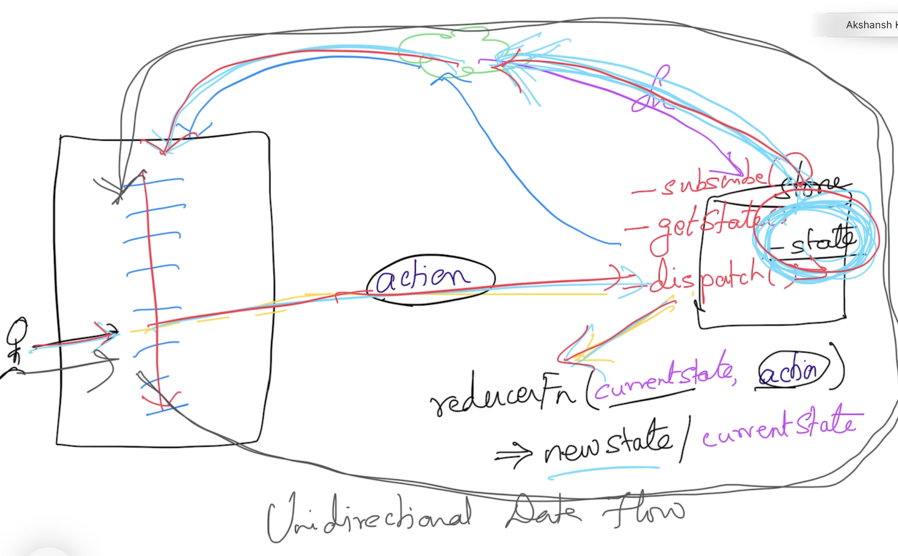

# React

## Magesh Kuppan
- tkmagesh77@gmail.com

## Break
- Lunch Break : 1:30 PM (30 mins)

## Software Requirements
- VS Code (or any editor)
- Node.js (LTS)
- Chrome Browser

## Methodology
- No powerpoint
- Discuss & Code

## Reference
- https://bit.ly/react-videos

## Repository
- https://github.com/tkmagesh/Deshaw-React-May-2024

## Rich Internet Applications
- Apps that are loaded in the browser
- The view is manipulated in the browser (NO server side view(html) generation)
- Same user experience as that of desktop applications
- RIA built using HTML/CSS/JS are called as Single Page Applications (SPA)

## Salary Calculator
- basic + hra + da - tax = salary

## View
- Has to be dumb
- React to user actions or react to model changes

## JSX vs HTML
- Every element MUST have a corrensponding close element (in jsx)
- Use 'htmlFor' in place of 'for'
- Use 'className' in place of 'class'
- All dynamic expressions have to be enclosed within '{}' (interpolation)

## Event Loop
- https://www.youtube.com/watch?v=i3T_x-F64sM&list=PL2OMOVtxSKThVeJJQjDPj5uAzsgIowF6x&index=1

## Views
- Component = Presentation (VDOM) + UI Behaviour + State (UI)
- Component will be automatically re-rendered when the state changes
- Components can be composed of other component

## React Hooks
- Used to handle side-effects in functional components
- Hooks are functions whose name should start with 'use'
- Hooks can be used ONLY either in a functional component or in another hook

## State
### Application State
- Any state that is domain specific
- It is highly likely change in this data need to be detected across the application
- DO NOT maintain this in the component

### UI State
- Any state that is UI specific
- It is highly unlikely change in this state need to be detected in other parts of the application
- Feel free to maintain this in the component itself (React.useState)

## State Management
## Unidirectional Data Flow

